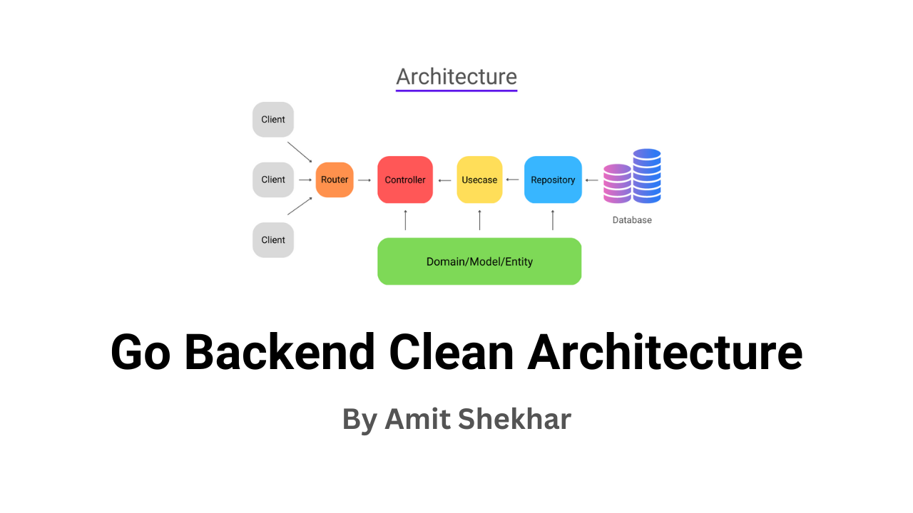

# ABARÉ API
---

## About the project

Abaré API is a Go RESTful API designed for managing users, diaries, families, and children participating in follow-up programs aimed at the development of children and teenagers with Autism Spectrum Disorder (ASD).

This project is being developed as part of the practical work for the Project Management and Supervised Internship disciplines of the ICEV software engineering course.

* Language: Go
* Framework: Gin
* Purpose: Manage entities related to ASD follow-up programs
* Disciplines: Project Management, Supervised Internship

## Summary

[TODO]

## Features and Roadmap

Feature | Status
--- | ---
Swagger documentation | Implemented
User authentication | Implemented
JWT access and refresh tokens | Implemented
User management | Semi Implemented
Diary entry management | Planned
Family entity integration | Planned
Child follow-up management | Planned

## Architecture



Abaré API follows the Clean Architecture model to ensure separation of concerns and maintainability. This architecture pattern helps keep the business logic independent from external frameworks, UI, databases, and other external factors.

```
README.md
go.mod
go.sum
.env
.gitignore
Dockerfile
docker-compose.yaml
Makefile
cmd/                     # Contains the main entry point for the application, where the app is executed.
    main.go              # Entry point for the application.
bootstrap/
    app.go               # Application initialization.
    database.go          # Database connection setup.
    env.go               # Environment variables loading.
    migration.go         # Database migrations.
    seed.go              # Seed data for database.
api/                     # Contains all the components responsible for managing HTTP requests of Gin.
    controller/          # Files that defines the logic for processing and responding to HTTP requests.
        ...
    middleware/          # Implements custom middlewares for things like authentication and logging.
        ...
    route/               # Defines the routing of all API endpoints.
        route.go         # Main routing setup.
        ...
data/                    # Stores resources required by the application.
    assets/              # Static assets and resources, mainly images for README.md
        ...
domain/                  # Holds files that defines the core business logic entities (e.g., User, Login, Diary), encapsulating the domain-specific rules and data structure.
    ...
internal/                # Contains auxiliary code files, such as utilities and helpers, that should only be used within the application.
    ...
repository/              # Contains data access logic files, which interacts with the database to retrieve and store data.
    ...
usecase/                 # Implements the business logic of the application, orchestrating different entities, repositories, and controllers.
    ...
docs/                    # Automatically generated API documentation using Swag, making it easy to explore the API’s endpoints.
    docs.go              # Swag-generated API documentation.
    swagger.yaml         # API specification.
.github/                 # Github related configurations
    workflows/           # Defines CI/CD workflows for automating tasks such as building, testing, and deploying the application.
        ...
```

### References

* [Github | amitshekhariitbhu: go-backend-clean-architecture](https://github.com/amitshekhariitbhu/go-backend-clean-architecture/tree/main)

## Documentation

Abaré API is documented using Swag. You can generate and view the API documentation by running the following commands:

```sh
make docs
```

This will generate the Swagger documentation, which can be accessed through the /docs/ route once the API is running.

## How to run

To run the project locally, use the Makefile for convenient commands:

Command | Description
--- | ---
make | Generate up to dates Swagger documentation and runs the API locally
make run | Runs the API locally
make build | Builds the API executable
make tests | Runs the test suite
make docs |	Generates Swagger documentation
make clean | Cleans up generated files and executables


## How to contribute

1. Clone the repository.
2. Create a new branch for the new feature (git checkout -b feature-branch).
3. Make your changes.
4. Submit a pull request.

## License

[TODO]

## Quote us

If you use or reference this project in your research or work, please cite us:

[TODO]
